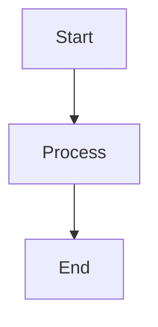
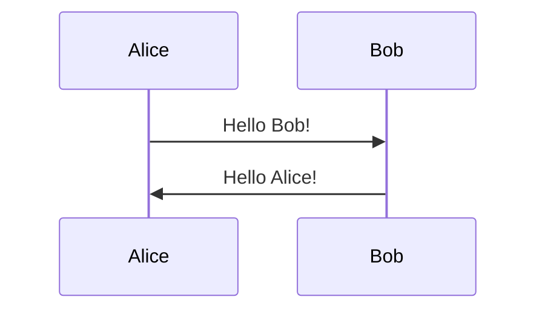
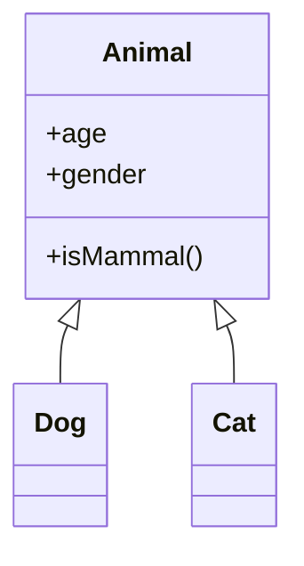
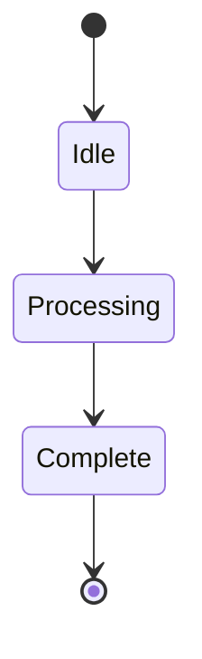
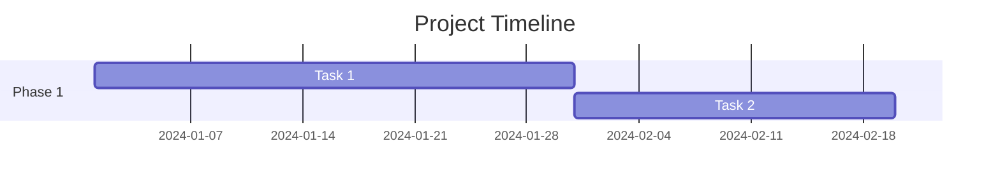
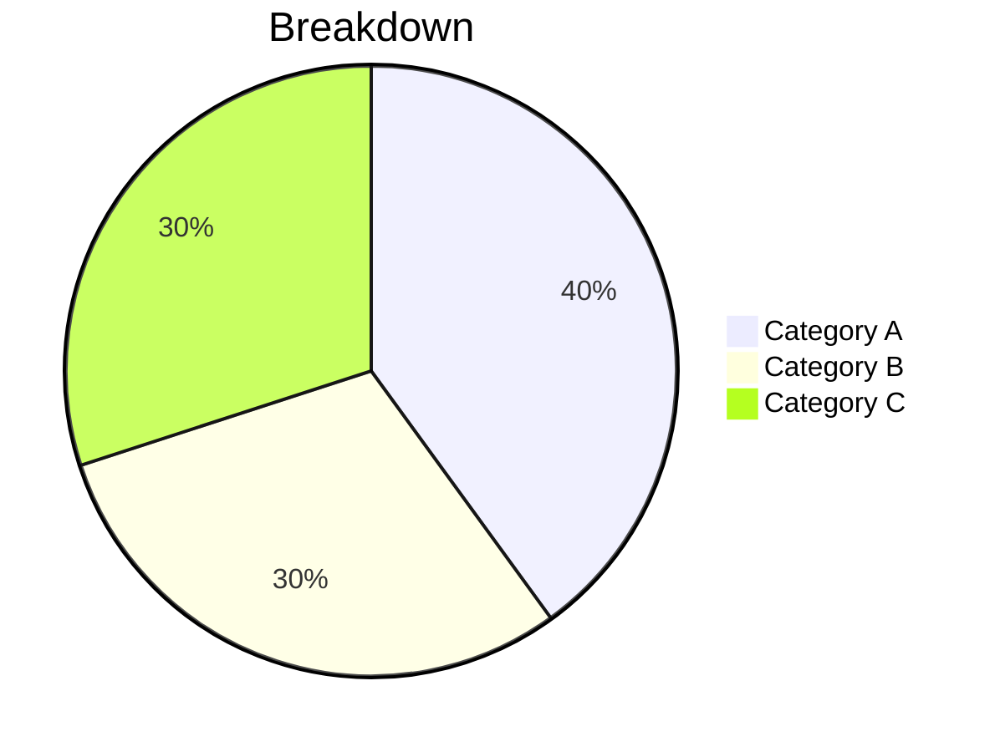

# @punk/component-mermaid

Mermaid diagram wrapper for Punk Framework - Create flowcharts and diagrams from text.

## Installation

```bash
pnpm add @punk/component-mermaid
```

## Features

- **Text-to-Diagram**: Create diagrams using simple text syntax
- **Multiple Themes**: Default, dark, forest, and neutral themes
- **Auto-Registration**: Automatically registers with Punk's ComponentRegistry
- **Renderer-Agnostic**: Works in DOM, GPU, and XR modes
- **Type-Safe**: Full TypeScript support with Zod schema validation
- **Error Handling**: Clear error messages for invalid syntax

## Usage

### Programmatic (React)

```tsx
import { Mermaid } from '@punk/component-mermaid'

function MyApp() {
  const flowchart = `
    graph TD
      A[Start] --> B{Is it working?}
      B -->|Yes| C[Great!]
      B -->|No| D[Debug]
      D --> B
  `

  return <Mermaid diagram={flowchart} theme="default" />
}
```

### JSON Schema (SynthPunk)

```json
{
  "type": "Mermaid",
  "props": {
    "diagram": "graph LR\n  A[Client] --> B[Server]\n  B --> C[Database]",
    "theme": "dark"
  }
}
```

### With DataContext

```tsx
import { PunkRenderer } from '@punk/core'
import '@punk/component-mermaid'

const schema = {
  type: "Mermaid",
  props: {
    diagram: "processFlow",
    theme: "forest"
  }
}

const data = {
  processFlow: `
    graph TD
      A[Input] --> B[Process]
      B --> C[Output]
  `
}

<PunkRenderer schema={schema} data={data} />
```

## Props

| Prop | Type | Default | Description |
|------|------|---------|-------------|
| `diagram` | `string` | required | Mermaid diagram syntax |
| `theme` | `'default' \| 'dark' \| 'forest' \| 'neutral'` | `'default'` | Diagram theme |

## Diagram Types

### Flowchart



```json
{
  "type": "Mermaid",
  "props": {
    "diagram": "graph TD\n  A[Start] --> B[Process]\n  B --> C[End]"
  }
}
```

### Sequence Diagram



```json
{
  "type": "Mermaid",
  "props": {
    "diagram": "sequenceDiagram\n  Alice->>Bob: Hello Bob!\n  Bob->>Alice: Hello Alice!"
  }
}
```

### Class Diagram



```json
{
  "type": "Mermaid",
  "props": {
    "diagram": "classDiagram\n  Animal <|-- Dog\n  Animal <|-- Cat"
  }
}
```

### State Diagram



```json
{
  "type": "Mermaid",
  "props": {
    "diagram": "stateDiagram-v2\n  [*] --> Idle\n  Idle --> Processing"
  }
}
```

### Gantt Chart



```json
{
  "type": "Mermaid",
  "props": {
    "diagram": "gantt\n  title Project Timeline\n  section Phase 1\n  Task 1 :a1, 2024-01-01, 30d"
  }
}
```

### Pie Chart



```json
{
  "type": "Mermaid",
  "props": {
    "diagram": "pie\n  title Breakdown\n  \"Category A\" : 40\n  \"Category B\" : 30"
  }
}
```

## Themes

### Default Theme
```json
{ "theme": "default" }
```

### Dark Theme
```json
{ "theme": "dark" }
```

### Forest Theme
```json
{ "theme": "forest" }
```

### Neutral Theme
```json
{ "theme": "neutral" }
```

## Examples

### System Architecture

```json
{
  "type": "Mermaid",
  "props": {
    "diagram": "graph LR\n  Client[Client App] --> API[REST API]\n  API --> DB[(Database)]\n  API --> Cache[(Redis Cache)]\n  API --> Queue[Job Queue]",
    "theme": "dark"
  }
}
```

### User Journey

```json
{
  "type": "Mermaid",
  "props": {
    "diagram": "journey\n  title User Shopping Journey\n  section Browse\n    Visit Site: 5: User\n    Search Products: 3: User\n  section Purchase\n    Add to Cart: 4: User\n    Checkout: 5: User",
    "theme": "default"
  }
}
```

### Git Workflow

```json
{
  "type": "Mermaid",
  "props": {
    "diagram": "gitGraph\n  commit\n  branch develop\n  checkout develop\n  commit\n  checkout main\n  merge develop\n  commit",
    "theme": "forest"
  }
}
```

## Error Handling

If the diagram syntax is invalid, the component will display a clear error message:

```tsx
<Mermaid diagram="invalid syntax here" />
// Displays: Mermaid Error: [error details]
```

## Styling

The component includes minimal default styling. You can customize appearance:

```css
.punk-mermaid-container {
  /* Container styles */
}

.punk-mermaid-error {
  /* Error display styles */
}
```

## Component Metadata

- **Category**: Data Visualization
- **Icon**: git-graph (Lucide)
- **Complexity**: Simple
- **Tags**: diagram, flowchart, mermaid, visualization

## Tips

1. **Use newlines**: Use `\n` in JSON strings for multi-line diagrams
2. **Escape quotes**: Use `\"` for quotes inside diagram strings
3. **Test syntax**: Validate diagrams at [mermaid.live](https://mermaid.live)
4. **Keep it simple**: Complex diagrams may be hard to read

## Related

- [@punk/component-chart](../component-chart) - Data visualization
- [@punk/component-table](../component-table) - Data tables
- [Mermaid Documentation](https://mermaid.js.org/)
- [Mermaid Live Editor](https://mermaid.live)

## License

MIT
